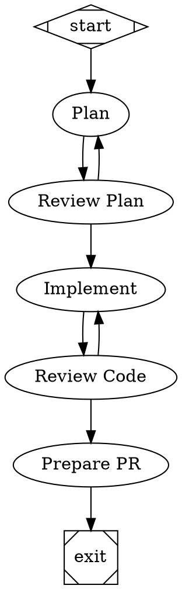

# Workflows

Workflows are directed graphs defined in the [DOT language](https://graphviz.org/doc/info/lang.html). Each node is either an **agent** stage (invokes a coding agent) or a **tool** stage (runs a shell command). Edges define the execution order, with optional conditional routing based on agent decisions.

## Quick Example



## Required Nodes

Every workflow must have:

- **`start`** — Entry point. Must have `shape=Mdiamond`, no incoming edges, at least one outgoing edge.
- **`exit`** — Success exit. Must have `shape=Msquare`, at least one incoming edge, no outgoing edges.

You can also define additional exit nodes for escalation:

```dot
escalate [shape=Msquare, exit_reason="human_review"]
```

---

## Node Attributes

### Agent Nodes

Run a coding agent (LLM) defined in WORKFLOW.md.

```dot
plan [
  type="agent",
  label="Plan",
  agent="planner",
  artifact_path=".vajra/run/plan.md",
  thread="planning",
  max_visits="4",
  on_exhaustion="escalate"
]
```

| Attribute | Required | Description |
|-----------|----------|-------------|
| `type` | Yes | Must be `"agent"` |
| `label` | Yes | Display name for the stage |
| `agent` | Yes | Name of an agent defined in WORKFLOW.md |
| `artifact_path` | No | File the stage writes — checked for non-empty after completion. If the file doesn't exist or is empty, the stage is marked as failed. |
| `thread` | No | Thread identifier. Stages sharing a thread maintain conversation context across visits — each revisit includes the full history of prior prompts and artifacts. |
| `max_visits` | No | Maximum times this node can be visited. Prevents infinite revision loops. |
| `on_exhaustion` | No | Node to route to when `max_visits` is exceeded (typically an `escalate` exit node). |

### Tool Nodes

Run a shell command. Tool invocations don't count against the agent invocation budget.

```dot
publish_pr [
  type="tool",
  label="Publish PR",
  command="vajra publish-pr --title-file .vajra/pr-title.txt --body-file .vajra/run/pr-body.md --base {{ target_branch }}"
]
```

| Attribute | Required | Description |
|-----------|----------|-------------|
| `type` | Yes | Must be `"tool"` |
| `label` | Yes | Display name |
| `command` | Yes | Shell command to execute (supports Liquid template variables) |

### Built-in Tool Commands

Vajra provides built-in commands for PR operations:

| Command | Description |
|---------|-------------|
| `vajra publish-pr` | Creates a new GitHub PR |
| `vajra update-pr` | Updates an existing PR (for revision workflows) |

Both accept the same flags:

| Flag | Description |
|------|-------------|
| `--title-file` | Path to file containing the PR title |
| `--body-file` | Path to file containing the PR body (markdown) |
| `--base` | Base branch for the PR (supports `{{ target_branch }}` template) |

These commands use the GitHub configuration from WORKFLOW.md and save PR metadata to `.vajra/pr.json`.

---

## Edge Routing

Edges can be unconditional or conditional:

```dot
// Unconditional — always follow this edge
plan -> review_plan

// Conditional — follow only when the agent emits this label
review_plan -> implement [on_label="lgtm"]
review_plan -> plan      [on_label="revise"]
review_plan -> escalate  [on_label="escalate"]
```

> **Important:** Use `on_label`, not `label`. The `label` attribute sets the node's display name. The `on_label` attribute controls routing.

### How Agents Emit Labels

Agents write a structured result file to `.vajra/run/stages/<stage-id>/result.json`:

```json
{
  "status": "success",
  "label": "lgtm",
  "notes": "Plan looks good, all files identified correctly."
}
```

The `label` field determines which outgoing edge to follow. Standard labels:

| Label | Meaning |
|-------|---------|
| `lgtm` | Approved — proceed to the next stage |
| `revise` | Needs changes — route back for revision |
| `escalate` | Can't proceed — needs human review |

### Routing Priority

When multiple outgoing edges exist, they're evaluated in this order:

1. **`on_label` match** — If the agent emitted a label and an edge has a matching `on_label`
2. **`condition` match** — If an edge has a `condition` attribute (not commonly used)
3. **Default edge** — The edge with no `on_label` or `condition`

If no valid next node is found, the pipeline fails.

---

## Revision Loops

The combination of `on_label` routing and `thread` attributes creates revision loops:

```dot
plan [type="agent", agent="planner", thread="planning", max_visits="4", on_exhaustion="escalate"]
review_plan [type="agent", agent="plan-reviewer"]

review_plan -> plan [on_label="revise"]   // Send back for revision
review_plan -> code [on_label="lgtm"]     // Approve and continue
```

When the reviewer says "revise" and the planner runs again:
- The planner sees its previous work via the thread continuation (full history of prior prompts and artifacts)
- It can iterate rather than starting from scratch
- After `max_visits` attempts, it routes to `on_exhaustion` instead of looping forever

---

## Safety Nets

Three independent mechanisms prevent runaway execution:

### 1. Per-Stage Visit Limits

```dot
plan [max_visits="4", on_exhaustion="escalate"]
```

If a stage is visited more than `max_visits` times, execution routes to the `on_exhaustion` target. If no `on_exhaustion` is configured, the pipeline fails.

### 2. Global Agent Invocation Budget

```yaml
# In WORKFLOW.md
execution:
  max_agent_invocations_per_run: 20
```

Every agent stage counts as one invocation. Tool stages don't count. If the budget is exhausted mid-pipeline, the pipeline fails.

### 3. Escalation Exit Nodes

```dot
escalate [shape=Msquare, exit_reason="human_review"]
```

When a pipeline reaches an escalation exit, Vajra moves the issue to the configured escalation state, posts a comment explaining what happened, and sends a Slack notification. All work done so far is preserved.

---

## Shipped Pipelines

| Pipeline | File | Description |
|----------|------|-------------|
| Default | `pipelines/default.dot` | Plan → review → code → review → PR. Full revision loops with escalation. |
| Revision | `pipelines/revision.dot` | Handles PR review feedback. Reads reviewer comments, makes changes, updates the PR. |
| Document | `pipelines/document.dot` | Documentation-focused. Writer → reviewer → exit (no PR). |
| Knowledge | `pipelines/knowledge.dot` | Knowledge article drafting with PR. |

---

## Creating a New Workflow

1. **Write the DOT file** in `pipelines/`:
   ```dot
   digraph MyWorkflow {
     graph [goal="Description of what this workflow does"]
     start [shape=Mdiamond]
     exit  [shape=Msquare]

     step_one [type="agent", label="Step One", agent="my-agent", artifact_path=".vajra/run/output.md"]

     start -> step_one -> exit
   }
   ```

2. **Define the agents** in WORKFLOW.md (see [Configuration — Agents](configuration.md#agents))

3. **Register the workflow** in WORKFLOW.md:
   ```yaml
   workflows:
     my-workflow:
       dot_file: pipelines/my-workflow.dot
       success_state: "Done"
       inspect_pr: false
   ```

4. **Optionally add label routing**:
   ```yaml
   workflow_routing:
     by_label:
       my-label: my-workflow
   ```

5. **Create the Linear label** in Linear (if using label routing) — the label must exist before any issue uses it.
